# Sample Architecture Diagrams

> **Mermaid diagrams** - Copy the code below and paste into any Markdown file or Mermaid editor.

## Basic Web Application Architecture

```mermaid
graph TB
    User[👤 User] --> LB[Load Balancer]
    LB --> App1[App Server 1]
    LB --> App2[App Server 2]
    LB --> App3[App Server 3]
    
    App1 --> Cache[Redis Cache]
    App2 --> Cache
    App3 --> Cache
    
    App1 --> DB[(Primary Database)]
    App2 --> DB
    App3 --> DB
    
    DB --> Replica[(Read Replica)]
    
    App1 --> Queue[Message Queue]
    App2 --> Queue
    App3 --> Queue
    
    Queue --> Worker1[Background Worker 1]
    Queue --> Worker2[Background Worker 2]
    
    Worker1 --> Storage[File Storage]
    Worker2 --> Storage
```



## Microservices Architecture


## Data Flow Diagram


## Deployment Architecture


## Security Architecture


## Event-Driven Architecture


## How to Use These Diagrams

### 1. Copy and Paste
Copy any diagram code and paste it into:
- GitHub README files
- GitLab documentation
- Mermaid Live Editor (https://mermaid.live/)
- VS Code with Mermaid extension

### 2. Customize for Your Architecture
- Replace service names with your actual services
- Add/remove components as needed
- Adjust relationships and data flows
- Update styling and colors

### 3. Version Control Your Diagrams
- Keep diagram code in your repository
- Update diagrams when architecture changes
- Use pull requests to review architecture changes

### 4. Generate Images
```bash
# Install mermaid CLI
npm install -g @mermaid-js/mermaid-cli

# Generate PNG from markdown
mmdc -i architecture.md -o architecture.png
```

## Pro Tips

> 💡 **Keep diagrams simple**: Focus on the most important components and relationships

> 🔄 **Update regularly**: Architecture diagrams should evolve with your system

> 📝 **Add context**: Include brief descriptions of what each component does

> 🎨 **Use consistent styling**: Establish color coding for different types of components
